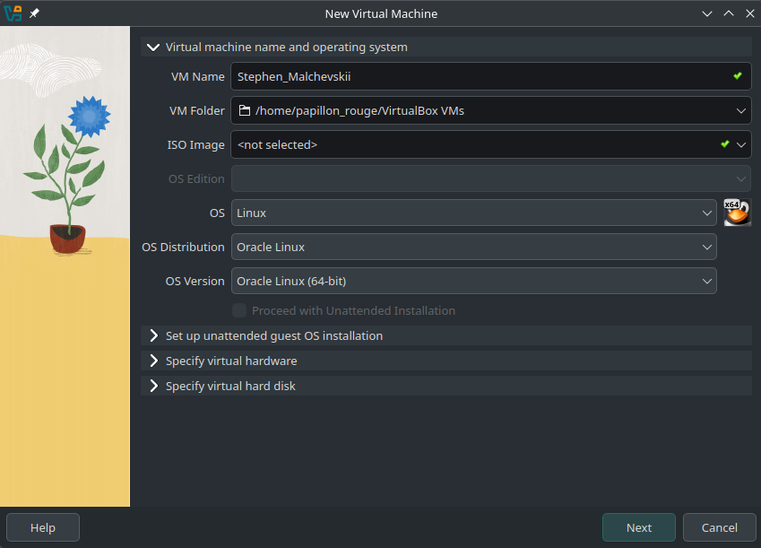
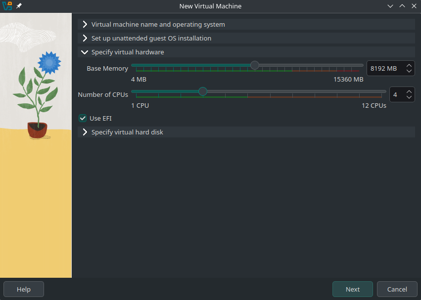
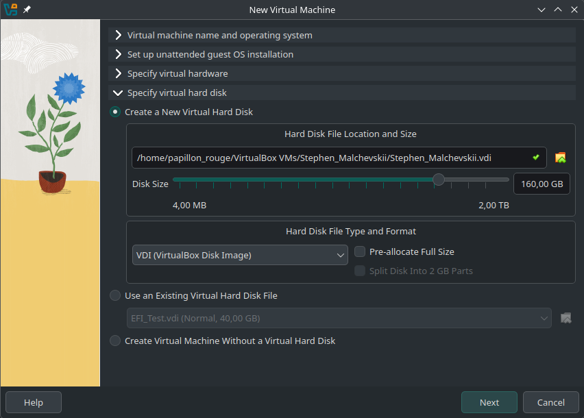
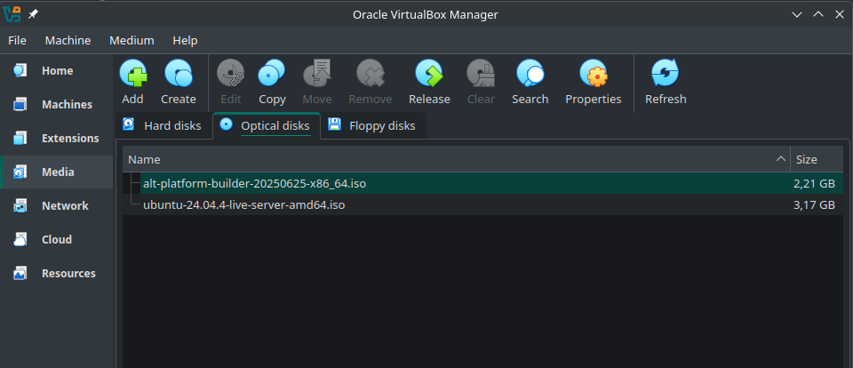
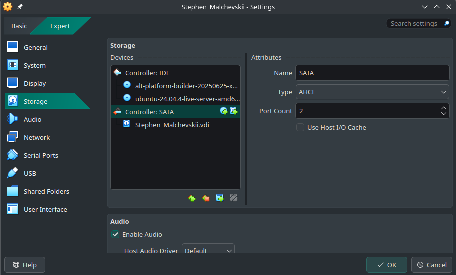
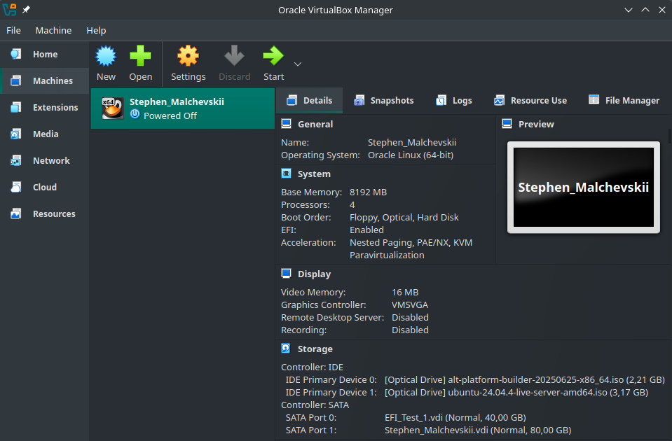

# Загрузка ОС, EFI

В данной директории расположены материалы и задания по лекции «Загрузка ОС, EFI»

 + [PDF-версия](./Загрузка_ОС_и_EFI.pdf) презентации
 + [HTML-версия](./OSBootSlides/linux_boot_reveal_edited.html) презентации
	 + Онлайн-просмотр доступен [по ссылке](https://usamg1t.github.io/Linux_Practic_Usage/Boot-EFI/OSBootSlides/linux_boot_reveal_edited.html)
	 + Исходники можно скачать и локально открыть в браузере
 + Текстовая версия лекции \[В разработке\]

## Самостоятельная работа

В качестве отчёта по пройденному материалу слушателям предлагается создать в системе виртуализации VirtualBox виртуальную машину с двумя ОС и продемонстрировать умение управлять настройками загрузки ОС.

### Последовательность действий

1. В системе VirtualBox создайте виртуальную машину
	1. Название виртуальной машины должно совпадать с вашими именем и фамилией, записанными латиницей через нижнее подчёркивание (например, Мальчевский Степан → «Stephen_Malchevskii»)
	2. Установите в качестве ОС-источника Linux
	3. Установите размер оперативной памяти 8192 байт, количество доступных ядер — 4. Установите галочку «Use EFI»
	4. Создайте виртуальный жёсткий диск размером от 80 Гб (предпочтительно — 160 Гб)

2. Установите загрузочные диски двух ОС: [Ubuntu Server](https://ubuntu.com/download/server) и [Alt Platform Builder](https://download.basealt.ru/pub/distributions/ALTLinux/p10/images/alt-platform/x86_64/alt-platform-builder-10.0.0-x86_64.iso). В разделе «Media» выберите «Оптические диски» и добавьте оба диска в в приложение.

3. В настройках виртуальной машины подключите диски в качестве IDE-контроллеров 

4. :round_pushpin: Сделайте контрольный снимок экрана с созданной виртуальной машиной.

5. Запустите виртуальную машину, установите обе системы.
6. После установки систем выполните (от имени суперпользователя) команду efibootmgr и :round_pushpin: сделайте снимок экрана с выводом.
7. :round_pushpin: Сделайте снимок экрана параметров GRUB на одном из дистрибутивов (просмотр параметров), затем измените настройки GRUB (список настроек можно найти в интернете; самый простой способ — изменение параметра "isolcpus=0-1" ), примените их и :round_pushpin: сделайте снимок экрана обновлённых параметров.

Все снимки экрана пришлите на почту преподавателя с указанием ФИО. Тема письма должна быть «\[LinuxPractice1\]<Фамилия> <Имя>»