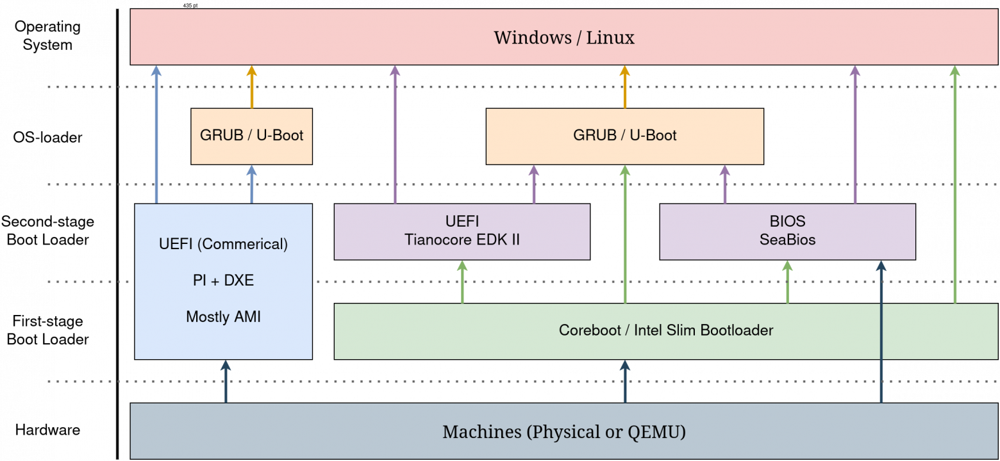
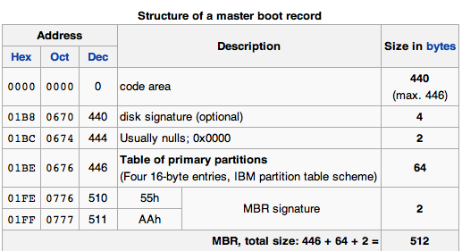
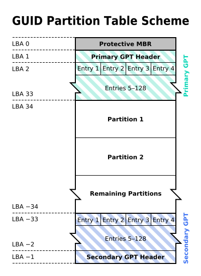
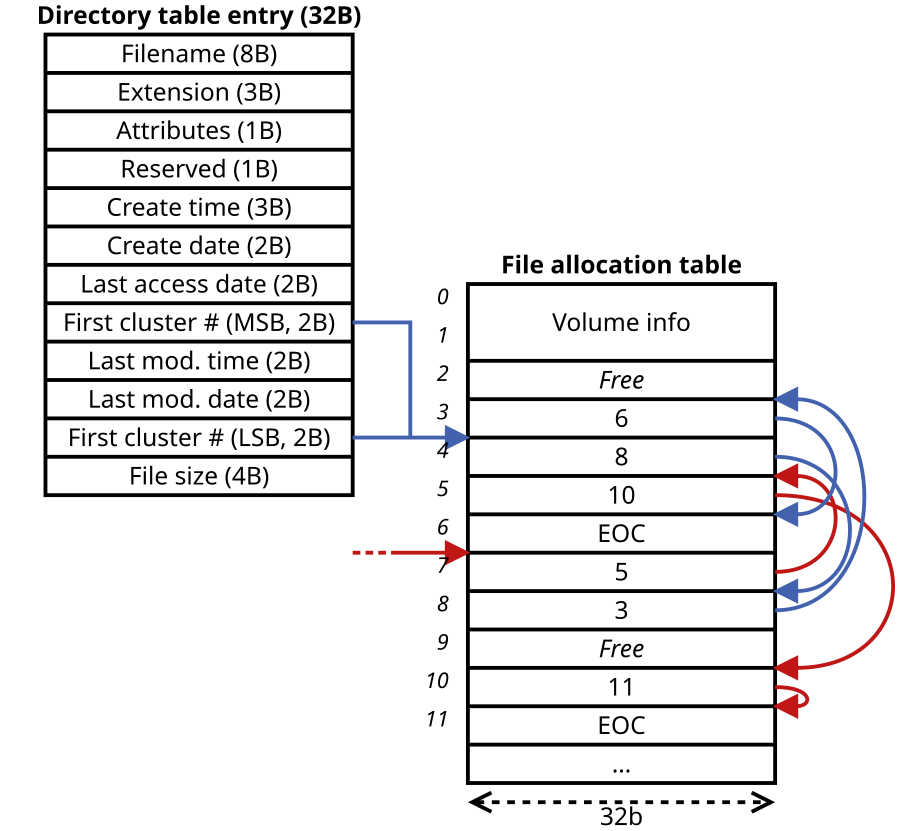

# Загрузка ОС как задача

Как передать управление от голого железа к операционной системе?

 + Начальная инициализация аппаратуры (процессор, память, контроллеры)
 + Запуск кода из энергонезависимой памяти на материнской плате
 + Поиск доступных вариантов загрузки (диски, флешки, сеть)
 + Выбор источника загрузки
 + Загрузка следующего компонента системы
 + Передача параметров запуска и управления

# Прошивка платформы и её роль

Роль микрокода:
 + Инициализировать необходимый мимнимум аппаратуры
 + Найти источники загрузки
 + Запустить менеджер загрузки

# BIOS и MBR — историческая схема загрузки

## Legacy BIOS

 + Историческая модель загрузки, разработанная IBM
 + Принцип работы:
	 + Прошивка выбирает устройство
	 + Читает первый сектор диска
	 + Передаёт ему управление напрямую
 + Проблемы:
	 + Сильная зависимость от архитектуры
	 + Куча зависимостей от исторических соглашений и ограничений (например, legacy-адреса выполнения кода загрузки)
	 + Ограниченные возможности расширения

## Master Boot Record (MBR)

 + Распологается строго на первом секторе диска:
	 + При повреждении первого сектора теряется информация о разделах
 + Размер 512 байт
 + Компоненты:
	 + Начальный код (bootloader) — первые 446 байт
	 + Таблица разделов — 64 байта (4 записи по 16 байт)
		 + Нет резервной копии таблицы разделов
	 + Сигнатура корректного MBR — 2 байта (0x55AA)
 + Записи разделов:
	 + Четыре записи фиксированного формата
	 	+ 32-битные адреса секторов
	 	+ Значит, максимальный размер диска для описания ~2ТБ
		 + Для большего количества записей — legacy объединение нескольких MBR-таблиц в связный список

# UEFI — современная модель загрузки

UEFI (Unified Extensible Firmware Interface) был разработан для преодоления ограничений BIOS:

Задачи для преодоления:
 + Избавиться от жёсткой архитектурной зависимости
 + Обеспечить стандартизованный интерфейс для разных платформ
 + Устранить архаичный формат «сектор + прыжок по адресу»
 + Сделать систему масштабируемой

_Результат_ — стандартизованная предзагрузочная среда
 + Все исполняемые элементы единого формата (т.н. _EFI-приложения_)
 + Стандартные сервисы и протоколы для работы загрузчиков
 + Запуск EFI-приложений как файлов

## NVRAM и Boot Variables

 + Энергонезависимая память прошивки
 	+ Управление порядком загрузки без изменения диска
 + Сохраняется между перезагрузками
 + Не зависит от архитектуры
 + Хранит переменные конфигурации загрузки
 	+ Boot####
 	+ BootOrder
 	+ BootNext
 	+ BootCurrent
 	+ Timeout

## GPT — GUID Partition Table

Замена MBR для EFI-систем
 + GUID как идентификаторы
	 + Уникальный 128-битный идентификатор
 + Структурированные записи о разделах
	 + 128 байт на запись (вместо 16 в MBR)
	 + До 128 разделов по умолчанию
	 	+ Фактически программного ограничения нет
 + Дополнительная система контроля целостности
	 + CRC32 заголовков и массива записей
	 + Обнаружение повреждений
 + Резервное копирование
	 + Основной и резервный GPT заголовок
	 + Копия массива записей в конце диска
	 + Возможность восстановления

### Структура GPT на диске

 + Protective MBR (LBA 0)
 + Primary GPT Header (LBA 1)
	 + Версия GPT, размер и количество записей
	 + CRC заголовка и массива записей
 + Partition Entry Array (LBA 2-33)
 + Partition Data
 + Secondary Partition Entry Array (LBA -32)
	 + Резервная копия массива записей
 + Secondary GPT Header (LBA -1)
	 + Резервный заголовок

Каждая запись о разделе содержит:

 + Тип раздела
 + Уникальный идентификатор раздела
 + Начальный и конечный LBA
 + Флаги опций
 + Имя раздела — Unicode строка до 72 символов

## EFI System Partition (ESP)

 + Специальный раздел для хранения EFI-образов
 + Единая точка размещения файлов загрузки
 + Может использоваться несколькими ОС

Структура ESP
 + Файловая система _FAT32_
	 + простая и совместимая почти со всем
 + Каталоги:
	 + `EFI/` — корневой каталог для EFI-приложений
	 + `EFI/BOOT/` — стандартный каталог для загрузчика
	 + `EFI/*/` — каталоги для конкретных ОС
 + Файлы загрузчиков:
	 + Исполняемые образы формата PE (Portable Executable)
	 + Ядро Linux с EFI stub
	 + initramfs/initrd для загрузки
	 + GRUB в формате EFI

# GRUB — многофункциональный загрузчик

Дополнительные возможности:
 + Выбрать версию ядра
 + Передать kernel parameters для ядра
 + Обработать разные сценарии загрузки

## Возможность обойтись без GRUB

 + _EFI stub_ — механизм, позволяющий ядру выглядеть как EFI-исполняемый образ
	 + Ядро компилируется с поддержкой EFI stub
	 + Ядро получает EFI-заголовок и становится EFI-приложением
	 + Ядро размещается на ESP
		 + Обычно в `EFI/boot/vmlinuz` или `EFI/ubuntu/vmlinuz`
		 + В NVRAM добавляется запись Boot####
	 + UEFI может запустить его напрямую
