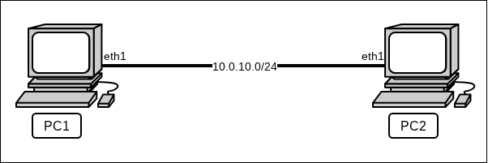

Работаем с [ВМ для лабораторных работ](https://github.com/UsamG1t/Nets_ASVK_Labs/blob/master/01_FirstStart/%D0%9D%D0%B0%D1%81%D1%82%D1%80%D0%BE%D0%B9%D0%BA%D0%B0%20%D1%81%D0%B8%D1%81%D1%82%D0%B5%D0%BC%D1%8B%20%D0%B4%D0%BB%D1%8F%20%D0%B2%D1%8B%D0%BF%D0%BE%D0%BB%D0%BD%D0%B5%D0%BD%D0%B8%D1%8F%20%D0%BB%D0%B0%D0%B1%D0%BE%D1%80%D0%B0%D1%82%D0%BE%D1%80%D0%BD%D1%8B%D1%85.md) по сетевым технологиям
 + Так просто проще настраивать всё
	 + С точностью до правильных интерфейсов можно повторить с любым образом
 + Есть удобные способы управления и взаимодействия с ВМ
	 + [Shell-сценарии](https://github.com/FrBrGeorge/vbsnap) (Linux only)
	 + Python-пакет [PySnap](https://github.com/usamg1t/neuropysnap) (Кроссплатформенный!)


```console
[user@localhost: ~] $  cd /tmp
[user@localhost: /tmp] $  python3 -m venv venv
[user@localhost: /tmp] $  source venv/bin/activate
[user@localhost: /tmp (venv)] $  pip install ~/Downloads/pysnap-0.1.1-py3-none-any.whl

Processing /home/papillon_rouge/Downloads/pysnap-0.1.1-py3-none-any.whl  
<…>
Successfully installed prompt_toolkit-3.0.52 pysnap-0.1.1 pyte-0.8.2 wcwidth-0.6.0

[user@localhost: /tmp (venv)] $ 
```

---

## Управление сервисами и `Systemd` 

 + Частное управление сервисами
	 + Простое конфигурирование приложений

 + «Сервисы по управлению сервисами»
	 + [OpenRC](https://ru.wikipedia.org/wiki/OpenRC) в Gentoo
	 + [Runit](https://ru.wikipedia.org/wiki/Runit) в Void Linux
	 + …

 + [`Systemd`](https://ru.wikipedia.org/wiki/Systemd)
	 + Главный разработчик — [Леннарт Пёттеринг](https://ru.wikipedia.org/wiki/%D0%9F%D1%91%D1%82%D1%82%D0%B5%D1%80%D0%B8%D0%BD%D0%B3,_%D0%9B%D0%B5%D0%BD%D0%BD%D0%B0%D1%80%D1%82)
	 + Инициализирующий комплекс программ Linux
	 + Управление всеми сервисами системы
	 + Как и всё хорошее — не без странностей ()

 + Структура:
	 + [`systemd.unit`](https://www.freedesktop.org/software/systemd/man/latest/systemd.unit)
	 + [`systemd.service`](https://www.freedesktop.org/software/systemd/man/latest/systemd.service)
	 + [`systemd.socket`](https://www.freedesktop.org/software/systemd/man/latest/systemd.socket)

 + `systemctl`— управление сервисами
	 + Команды ручного управления сервисами (`start / restart / stop / status`)
	 + Команды автоматического подключения сервисов (`enable` / `disable`)
	 + Команда описания и редактирования сервисов (`edit`) 

## Связь с интерпретатором

 + Полноценный сервис:
	 + Сам создаёт сокет подключения
	 + Сам его обрабатывает
	 + Сам обрабатывает ввод-вывод
	 + Сам завершается
 + Сокет-активация (`daemon`):
	 + Обслуживание сокета на плечах `Systemd`
	 + Сервис работает с просто с потоками ввода-вывода
		 + Вообще говоря, любыми, ему без разницы
 + —реализация:
	 + `Systemd` создаёт и управляет сокетом, но не наполняет его
	 + Всё, кроме создания, уходит в сервис
		 + Ограничение прав доступа

## Запуск сетевого сервиса



```console
$ ss -ltp
$ socat TCP-LISTEN:1234 EXEC:/usr/bin/cal &
$ netcat localhost 1234
```

\* Параметры `socat`:
 + reuseaddr
 + fork

### Запуск полноценных сервисов с помощью `Systemd`

`cal.service`
```
[Unit]  
Description=Calendar  
  
[Service]  
ExecStart=/usr/bin/socat TCP-LISTEN:1234,reuseaddr,fork EXEC:/usr/bin/cal
```

### Запуск демонов с помощью `Systemd`

`hexdump.socket`
```
[Unit]  
Description=Hex Dump Socket  
  
[Socket]  
ListenStream=1234  
Accept=yes
```

`hexdump@.service`
```
[Unit]  
Description=Hex Dump  
  
[Service]  
ExecStart=/usr/bin/hexdump -C  
StandardInput=socket
```

```console
$ systemctl | grep hexdump
```

## Перманентная настройка сети с помощью `systemd-networkd`

```console
$ networkctl
```

`/etc/systemd/network/10-eth0.network`
```console
[Match]  
Name=eth0  
  
[Network]  
Address=10.0.2.15/24  
Gateway=10.0.2.2
```

`/etc/systemd/network/50-internal.network`
```console
[Match]  
Name=eth1  
  
[Network]  
Address=10.0.10.2/24

[Route]  
Gateway=0.0.0.0  
Destination=10.0.10.1
```

Важный -момент: в случае ошибок при настройке **нигде** кроме `journalctl` это отмечено не будет. При этом все корректные части настройки сработают.