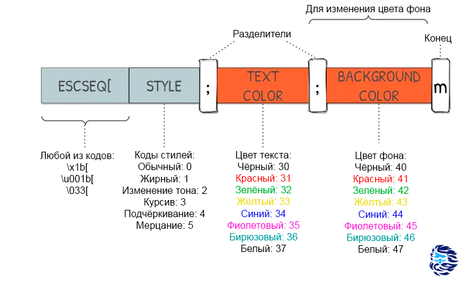

## Терминал — основной интерфейс управления компьютером

 + Обеспечение ввода-вывода данных на экран
	 + и всё...
 + Внутренняя обработка команд

### Немного истории
 + Ручная настройка **всего** и [перфокарты](https://ru.wikipedia.org/wiki/Перфокарта)
 + [Телетайпы](https://ru.wikipedia.org/wiki/Телетайп) — шаг от телеграфа к компьютеру
 + [Терминал](https://ru.wikipedia.org/wiki/Компьютерный_терминал) как отдельное устройство
	 + Отсюда много телеграфных тонкостей — позиционирование курсора, «жирный шрифт и подчёркивания» телеграфным способом
	 + Классические построчные редакторы, например, [ed](https://ru.wikipedia.org/wiki/Ed)


### Escape-последовательности
 + Решение проблемы управления внешним видом дисплея
 + Передача информации о не-буквенных клавишах



## Языки склейки
 + Универсальность работы с программами

Три основных требования к языкам склейки:
 + С их помощью мы можем использовать команды, встроенные в нашу систему;
 + Множество доступных нам команд _алгоритмически полно_;
 + С их помощью настроен удобный интерфейс объединения команд, их суперпозиция

### Unix Shell
 + Интерпретатор командной строки
 + Работа преимущественно с текстовыми данными

**Основные блоки команд:**

 + Работа с переменными
```console
localhost% a=4
localhost% echo $a
4
localhost%
```

 + Арифметика
```console
localhost% A=2; B=3

localhost% echo $((A+B))
5
localhost% echo $((A+B-13))
-8
localhost% expr $A + $B
5
```

 + Пространства имён
```console
user@localhost:~> zsh

localhost% A=1
localhost% echo $A
1

localhost% zsh
localhost% echo $A

localhost% ASD=123
localhost% echo $ASD
123

localhost% exit
localhost% echo $ASD

localhost% echo A
A

localhost% export A
localhost% zsh
localhost% echo $A
1
localhost% exit
localhost% exit
user@localhost:~>
```

 + Функции
```console
user@localhost:~> A() { echo qq; }
user@localhost:~> A
qq
user@localhost:~>
```

 + Встроенная работа с текстом
```console
user@localhost:~> A=123.456.678
user@localhost:~> echo ${A}b # вывод форматированного текста
123.456.678b
user@localhost:~> echo $Ab # считает, что это переменная из двух букв и, очевидно, не находит её в своём словаре

```

```console
localhost% A=123/456/789
localhost% echo $A
123/456/789
localhost% echo ${A}
123/456/789

localhost% echo ${A%/*} # Отрезание хвоста данных (отрезает последнее совпадение шаблону /*)
123/456
localhost% echo ${A%%/*} # Жадное отрезание хвоста (по первому совпадению)
123
localhost% echo ${A#*/} # отрезание головы (по первому совпадению)
456/789
localhost% echo ${A##*/} # Жадное отрезание головы (по последнему)
789

localhost% A=123.426.678
localhost% echo ${A/2/E} # замена первого совпадения
1E3.426.678
localhost% echo ${A//2/E} # Замена всех совпадений
1E3.4E6.678
```

 + Поддержка многокомандных сценариев в командной строке

```console
localhost% A=Hello
localhost% echo $A
Hello

localhost% {sleep 1; echo 1; sleep 1; echo 2; sleep 1; echo QQ}  # запуск скрипта в данном* процессе
1
2
QQ
localhost% {sleep 1; echo 1; sleep 1; echo 2; sleep 1; echo QQ} & # запуск скрипта фоновым процессом — можем продолжать работу
[1] 189666
localhost% echo $A # успеваем вызывать другие команды Shell
Hello
1
localhost% echo $A
Hello
2
localhost% echo $A
Hello
QQ

[1]  + 189666 done       { sleep 1; echo 1; sleep 1; echo 2; sleep 1; echo QQ; }
localhost%
```

 + Управление потоками данных
	 + Перенаправление ввода-вывода
	 + Конвейер
	 + Ограничение ввода

 + Условный оператор (if-fi)

$$\textrm{if\ \textbf{команды};\ then\ \textbf{команды-True};\ else\ \textbf{команды-False};\ fi}$$

	 + В качестве условия выступает код завершения последней команды условия

 + Цикл
	 + Цикл с условием: 

$$\textrm{while\ \textbf{команды};\ do\ \textbf{команды};\ done}$$

	 + Цикл по последовательности: 

$$\textrm{for\ \textbf{переменная}\ in\ \textbf{слова};\ do\ \textbf{команды};\ done}$$


\* Проверка условия — утилита test (или просто \[ )

 + Оператор выбора

Вид выражения:
```
case <выражение> in
	<шаблон 1>) <команды> ;;
	...
	<шаблон N>) <команды> ;;
	*) <команды> ;;
esac
```
### Полезные утилиты
 + Работа с файлами — `cp`, `ls`, `mv`, `cat`
	 + `find` для поиска файлов по предикатам
 + Работа с текстом — `head`, `tail`, `sort`, `tee`,  `cut`
 + Комбайны — `grep`, `sed`